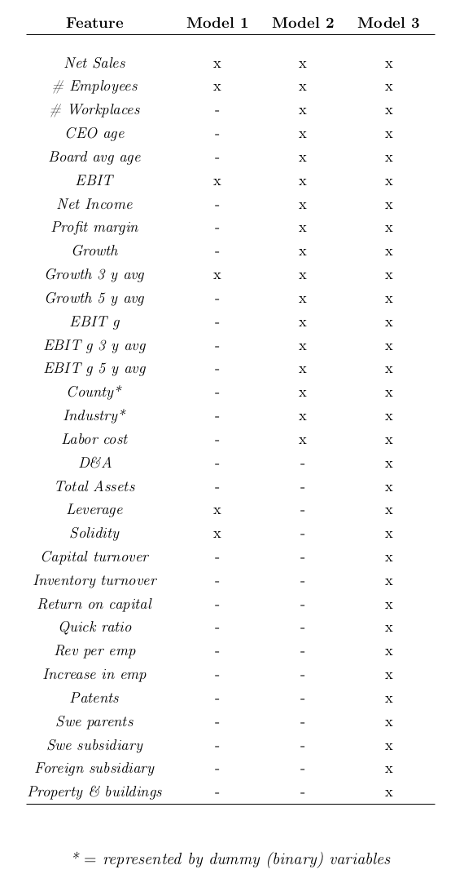

#### Identifying New Customers Using Machine Learning for B2B-sales

Uncover hidden opportunity to grow sales faster by finding potential customers that would be interested in buying within a B2B context. 
Therefore, this codebase does not solely have an academic value but also a commercial purpose that delivers high business value as well.

#### Highlights

* Produces Machine Learning models to identify potential customers in a B2B-sales context
* Adaptive PU Learning (AdaPULearning) performs 4.8 times better than a random baseline classifier to find new prospects in B2B sales
* PU-learning Using an Adapted Classifier as proposed by: PATRIK NORLIN, VIKTOR PAULSRUD in their paper: "Identifying New Customers: Using Machine Learning A case study on B2B-sales in the Swedish IT-consulting sector
* Link to paper which is also included in this repo: https://pdfs.semanticscholar.org/9813/21d9f06a51110d6585bce4dcc14f624acbc0.pdf

#### Data modeling instructions

* In order to uncover who your customers are, you need previous customer data from your sales analytics or some sales pipeline data model
* If you need help building a sales data model to fit this Machine Learning technique, scale out for accelerated GPU compute for large enterprise data sets, or build machine learning on graph data for even more B2B sales growth, please [get in touch](https://www.linkedin.com/in/computer-vision-engineer/).

#### Map your sales data to the starter model below:

#### Tips

    You can compare the performance of the estimator using the F1 score, precision and recall for whatever model you end up using.

    Typical results show that AdaPULearning (Adaptive PU Learning, as presented in the cited paper) greatly increases the performance of an estimator (depedning upon the model up to 4.8 times).
    In the case where the negative examples are contaminated with positive examples. We call this situation positive and unlabled learning.
    
    These models are candidates for transfer learning or from LinkedIn, Dunn & Bradstreet APIs found here: https://developer.dnb.com/, that you could convert into a graph and gain increased sales growth from
    this PU Learning example on Graph Data. 
    

### Email Contact

Email: joehoeller@gmail.com

